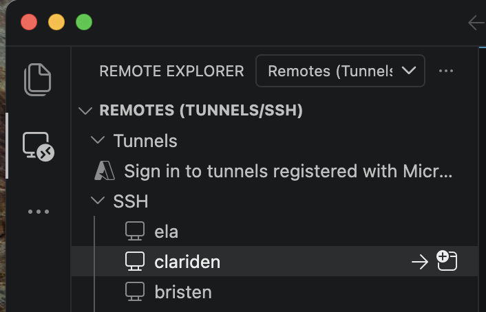

# Accessing Resources Clariden

<br>

## Slurm, VS Code and Docs

<br>

Ben Cumming

bcumming.github.io/ml-mentors

---
layout: two-cols
layoutClass: gap-2
---

# Slurm

What is Slurm

::right::

```
Basic slurm examples
```

---

# Slurm: interactive sessions

---

# Slurm: allocating GPUs

---

# CSCS Documentation

[`docs.cscs.ch`](https://docs.cscs.ch) is a good starting point for information:
* [PyTorch](https://docs.cscs.ch/software/ml/pytorch/)
* [Jupyter](https://docs.cscs.ch/access/jupyterlab)
* [VS Code](https://docs.cscs.ch/access/vscode)
* [ML Platform](https://docs.cscs.ch/platforms/mlp)

<br>

Ideal world: all questions are answered by a link to the docs

* Let us know if something is missing/unclear/wrong

---
layout: two-cols
layoutClass: gap-2
---

# VS Code

VS Code ([`docs.cscs.ch/access/vscode`](https://docs.cscs.ch/access/vscode)) provides a familiar **IDE experience on Alps** using **remote development** features
1. launches a VS Code server on the remote system
2. connects it to the IDE running on your laptop

<br>

**The catch: the server must be started inside the target environment**

We want to run in our container on a compute node

::right::

Using remote SSH is the easiest way to connect



❌ unfortunately this doesn't work because the server:
* is running on a login node
* is running bare metal

---
layout: two-cols
layoutClass: gap-2
---

# VS Code


---

## Good Luck


